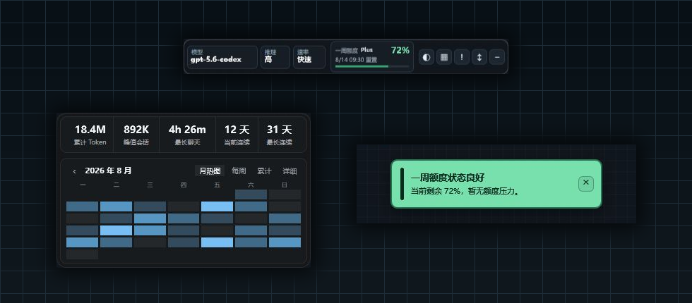

# CodexFloatingBar

[](#系统要求)
[](go.mod)
[](LICENSE)

CodexFloatingBar 是一个面向 Windows 的轻量级 Codex 桌面状态浮条。它使用 Go 和
Win32 原生窗口显示模型、推理强度、额度与 Token 统计，并提供托盘、主题、布局、
多显示器和跟随 Codex 显示状态等桌面集成功能。

正式程序不包含工作台 HTTP 服务或 Edge 导出代码，不嵌入 WebView，也不依赖
Node.js、React、.NET、Wails 或 CGO。HTML/CSS/JavaScript 仅供独立的设计时工作台
和 UI 资源导出使用。

## 界面预览

<p align="center">
  
</p>

上图由项目工作台调用正式程序同一套 DirectWrite/Direct2D 合成路径生成，展示横版
状态浮条、Token 统计窗口和额度提醒。程序还支持竖版布局、浅色主题、多档缩放及托盘
菜单，可在不打开 Codex 主窗口的情况下持续查看运行状态。

## 核心特点

| 能力 | 说明 |
| --- | --- |
| 原生轻量运行 | Go + Win32 分层窗口，不携带浏览器内核、WebView 或前端运行时 |
| Codex 状态概览 | 同时显示模型、推理强度、速度档位、PLAN、一周额度和重置时间 |
| Token 统计 | 月热图、每周、累计和单日详情，覆盖输入、输出、缓存及推理 Token |
| 桌面集成 | 托盘、单实例、开机启动、自动收起、位置记忆和多显示器 DPI |
| 可调整 UI | HTML/CSS 工作台负责设计，正式程序只消费经过验证的静态资产与动态槽 |
| 本地隐私边界 | 只读取必要的本地 Codex 数据，UI 不接收 JWT、原始 session 或日志正文 |

> [!NOTE]
> 本项目是社区项目，并非 OpenAI 官方产品。Codex、ChatGPT 和 OpenAI 是其各自
> 权利人的商标。

## 项目沿革

本项目是原
[CodexFloatingBar](https://github.com/liuguoqiang0730-svg/CodexFloatingBar)
的 Go/Win32 原生重写。它保留原项目的 MIT License、应用/托盘图标、旧设置迁移能力
和数据行为对照结果；原 WPF/C# 源码及运行时依赖未包含在当前实现中。完整资源来源见
[资源来源与继承说明](docs/asset-provenance.md)。

## 功能详情

- 显示当前模型、推理强度、速度档位和额度窗口。
- 支持横向与纵向浮条、深色与浅色主题以及多档缩放。
- 提供月热图、每周统计、累计统计和详细 Token 面板。
- 详细面板显示输入、输出、总量、缓存、推理 Token、Cache Hit 和等价成本。
- 点击月历日期可查看单日数据；未选择日期时显示当前浏览月份汇总。
- 历史 session 统计写入本地缓存；未变化文件不会重复扫描，只分析新增或追加内容。
- 支持统计窗口、额度提醒、自动收起、位置记忆和多显示器负坐标。
- 支持托盘菜单、单实例唤醒、开机启动以及跟随 Codex 显示、最小化或被其他窗口完全遮挡的状态。
- 正式运行时仅使用 Go、Win32、DirectWrite/Direct2D 和预导出的静态 UI 资产。

## 系统要求

### 运行程序

- Windows 10 22H2 或 Windows 11，x64。
- 已安装并登录 Codex Windows 桌面应用。

### 从源码构建

- Go 1.26 或与 `go.mod` 兼容的更新版本。
- PowerShell 5.1 或 PowerShell 7。
- Microsoft Edge，仅用于工作台导出 PNG，不是正式程序运行依赖。
- NSIS，仅在生成安装包时需要。

## 快速开始

### 克隆并验证

```powershell
git clone https://github.com/raywangsmia-bit/CodexFloatBar.git
Set-Location CodexFloatBar

$env:GOCACHE = Join-Path $PWD '.cache\go-build'
$env:GOMODCACHE = Join-Path $PWD '.cache\go-mod'
$env:CGO_ENABLED = '0'

go test ./...
go vet ./...
.\scripts\build-workbench.ps1 -TestOnly
```

### 构建

```powershell
New-Item -ItemType Directory -Force bin | Out-Null
go build -trimpath -ldflags "-H=windowsgui" -o bin\CodexFloatingBar.Next-dev.exe .
```

### 运行

```powershell
.\bin\CodexFloatingBar.Next-dev.exe
```

程序启动后驻留系统托盘。拖动浮条的非按钮区域可移动窗口；托盘菜单可调整主题、
布局、缩放、自动收起、跟随 Codex 和开机启动。

## 架构

```text
设计时
ui/workbench HTML + CSS + JavaScript
             │
             ├─ Edge 渲染 14 个 surface、4 档 DPI
             ▼
ui/dist/manifest.json + 56 张 PNG

运行时
.codex 配置、session 与额度日志
             │
             ├─ Go 数据服务：增量读取、缓存、聚合
             ▼
受限 UI 数据槽 + 静态 PNG
             │
             ├─ DirectWrite/Direct2D 动态合成
             ▼
Go + Win32 分层窗口、托盘与系统集成
```

正式程序不会解析工作台 HTML，也不会把认证文件、JWT、session 原文或日志正文传递给
UI。UI 只接收经过聚合的最小数据对象。

## UI 工作台

构建并启动独立工作台：

```powershell
.\scripts\build-workbench.ps1
.\bin\CodexFloatingBar.Workbench.exe
```

浏览器访问 <http://127.0.0.1:9315/>。常用流程：

1. 修改 `ui/workbench/index.html`、`styles.css` 或 `app.js`。
2. 在工作台检查主题、布局、缩放和原生合成预览。
3. 点击“导出到 Go 程序”。
4. 确认 `ui/dist/manifest.json` 和新资源 generation 已更新。
5. 运行测试和生产构建。

工作台会根据 `ui/workbench` 内全部静态文件的规范化路径和内容计算 SHA-256 指纹。
导出采用临时目录和原子切换；导出失败时保留上一份可用 UI。

工作台通过 `workbench` 构建标签生成独立 EXE。正式 Floating Bar 默认构建不会编译
工作台服务器、导出端点或 Edge 进程管理代码；工作台也不会启动原生浮条、托盘、
Codex 数据监控或读取真实账户/session 数据。

### UI 资产提交规则

修改工作台后，以下内容必须在同一个提交中保持一致：

- `ui/workbench/` 中的 HTML、CSS 和 JavaScript 源文件。
- `ui/dist/manifest.json`。
- `manifest.json` 引用的 `ui/dist/assets/<generation>/` PNG。
- 对应的 Go 动态绑定、命中区域或测试（如果契约发生变化）。

不要只提交工作台源码而遗漏导出资产，也不要提交 manifest 未引用的旧 generation。

## 数据与缓存

程序只读当前用户的以下 Codex 数据：

- `.codex/config.toml`
- `.codex/auth.json` 中必要的账户显示信息
- session JSONL
- 本地额度日志尾部

统计缓存位于：

```text
%LOCALAPPDATA%\CodexFloatingBar.Next\usage-statistics-cache.json
```

缓存按 session 文件大小和修改时间复用结果。文件追加时从上次安全偏移继续解析；历史
文件不会重复全量统计。缓存损坏或版本不兼容时会自动重建。

## 项目结构

```text
.
├─ internal/                数据、设置、进程监视和应用身份
├─ ui/workbench/            HTML/CSS/JavaScript 设计工作台
├─ ui/dist/                 正式程序使用的 UI manifest 与 PNG
├─ scripts/                 正式程序、独立工作台、发布和验证脚本
├─ installer/               NSIS 安装器定义
├─ resources/               Windows 资源和发布元数据
├─ docs/                    架构、迁移、验证与发布报告
└─ *.go                     原生窗口、渲染、交互和系统集成
```

更详细的设计与验证记录见：

- [原生重写计划](docs/native-rewrite-plan.md)
- [P0 架构验证](docs/native-p0-report.md)
- [P2 数据与 UI 合成](docs/native-p2-report.md)
- [P3 系统集成](docs/native-p3-report.md)
- [Beta 发布与回滚](docs/native-beta-release.md)

## 发布

执行完整 Beta 发布流程：

```powershell
.\scripts\publish-next.ps1
```

该脚本依次执行静态发布门槛、测试、构建、便携包与安装包生成、SHA-256 校验以及旧候选
清理。默认输出到 `release/next-beta-<version>/`。

仅预览清理目标：

```powershell
.\scripts\cleanup-releases.ps1 -KeepReleases 2 -WhatIf
```

签名发布可传入证书指纹：

```powershell
.\scripts\publish-next.ps1 `
  -SigningCertificateThumbprint <40位证书指纹> `
  -TimestampUrl http://timestamp.digicert.com
```

安装、升级、卸载、验证包和回滚说明见
[docs/native-beta-release.md](docs/native-beta-release.md)。

## Git 协作规范

1. 从最新主分支创建短生命周期分支，例如 `feature/token-detail`、
   `fix/follow-codex` 或 `docs/readme`。
2. 一个提交只解决一个清晰问题，避免混入无关格式化或生成文件。
3. 推荐使用 Conventional Commits：

   ```text
   feat: add daily token details
   fix: detect hidden Codex window
   docs: update build instructions
   test: cover incremental session parsing
   ```

4. 提交前至少运行：

   ```powershell
   go test ./...
   go vet ./...
   .\scripts\build-workbench.ps1 -TestOnly
   go build -trimpath -ldflags "-H=windowsgui" -o .cache\verify\CodexFloatingBar.exe .
   go build -tags workbench -trimpath -o .cache\verify\CodexFloatingBar.Workbench.exe .
   git diff --check
   ```

5. 不得提交 `.cache/`、`.tools/`、`bin/`、`release/`、`runtime-data/`、用户配置、
   认证数据、日志或本机绝对路径。
6. 不要覆盖、回退或批量暂存其他贡献者尚未提交的修改。
7. Pull Request 应说明变更目的、验证结果、已知差异；UI 变更应附工作台和原生合成
   预览，并确认窗口尺寸及多 DPI 资产一致。

## 安全与隐私

- 不要在 Issue、日志、测试 fixture 或提交中上传真实 JWT、API Key、session 内容或账户
  信息。
- 测试数据必须脱敏，并使用 `example.invalid` 等保留域名。
- 程序不会修改 Codex 配置、认证文件或 session。
- 安装器发现应用正在运行时不会强制结束进程；静默流程返回明确错误码。

如发现安全问题，请不要公开敏感复现数据；请通过仓库维护者提供的私密渠道报告。

## 许可证

本项目采用 [MIT License](LICENSE)。发行包同时包含
[第三方许可声明](THIRD_PARTY_NOTICES.txt)，资源继承与托盘图标来源记录在
[资源来源与继承说明](docs/asset-provenance.md) 中。
